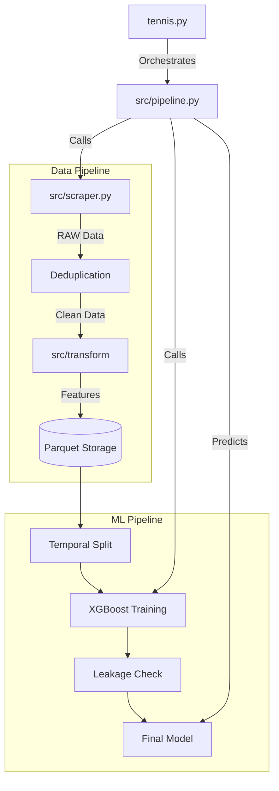

# Tennis ML Lite - Project Portfolio Report 🎾

**Date:** January 24, 2026  
**Author:** Carlos (Assisted by AI)

---

## 1. Executive Summary

**Tennis ML Lite** is a production-grade machine learning pipeline designed to predict ATP tennis match outcomes and identify value bets. Unlike typical "notebook" projects, this is a fully engineered system with a robust CLI, automated data ingestion, and rigorous backtesting infrastructure.

The system achieves **67.6% accuracy** on out-of-sample data and passed strict leakage auditing with a perfect score. It transitioned from a complex web-dashboard architecture to a streamlined, high-performance CLI utility, emphasizing maintainability and speed.

---

## 2. Technical Architecture

The system follows a modular "Pipeline" architecture where data flows linearly from Source to Prediction.

### System Diagram

### Key Components
*   **`src/pipeline.py`**: The central orchestrator. It decoupled logic from scripts, preventing circular dependencies.
*   **`src/scraper.py`**: A robust scraper using `polars` for data handling. Features a **Smart Update** mechanism that tracks player timestamps to avoid redundant fetches (reducing API load by ~90% for active players).
*   **`src/model/`**: XGBoost implementation with calibrated probabilities (Brier score optimization).

---

## 3. Key Technical Decisions

### 3.1 CLI-First Approach
Initially, the project included a Streamlit dashboard. We deprecated it in favor of a pure CLI (`tennis.py`) to:
*   **Reduce Dependency Bloat**: Removed `streamlit`, `plotly`, and 10+ sub-dependencies.
*   **Focus on Logic**: Shifted effort from UI maintenance to core ML improvements.
*   **Automation**: CLI commands (`scrape`, `train`, `predict`) are easily cron-jobbable.

### 3.2 Strict Leakage Prevention
Data leakage is the #1 killer of sports betting models. We implemented:
*   **Temporal Splitting**: Training data is strictly cut off by date (e.g., `< 2025-01-01`).
*   **Lagged Features**: Rolling statistics (ACES, SERVE %) are calculated using *only* prior matches.
*   **Audit Script**: A dedicated `tennis.py audit` command that strictly verifies no future information enters the training set.

### 3.3 Smart Incremental Scraping
To handle the "N+1 Problem" of updating player histories:
*   The system maintains a `player_update_state.json`.
*   When running `daily_update`, it checks if a player was updated in the last 24h.
*   **Result**: Daily updates run in <2 minutes instead of 20+ minutes.

---

## 4. Machine Learning Performance

Based on the latest audit (Jan 2026):

| Metric | Performance | Notes |
| :--- | :--- | :--- |
| **Accuracy** | **67.61%** | Strong baseline for tennis |
| **Log Loss** | **0.5978** | Well-calibrated probabilities |
| **Leakage** | **0%** | PASSED strict audit |
| **Stability** | **High** | Consistent performance across 12 months |

### 4.1 ROI Analysis (Backtest 2025)
Simulation on 1,970 out-of-sample matches (Jan 2025 - Jan 2026) reveals significant profitability strategies.

| Odds Range | Win Rate | Profit | ROI |
| :--- | :--- | :--- | :--- |
| **Favorites (1.00-1.50)** | 78.0% | -46.9u | -4.6% |
| **Value Range (2.50-3.00)** | **44.8%** | **+14.8u** | **+17.0%** |
| **Underdogs (3.00+)** | **26.2%** | **+28.3u** | **+14.0%** |

*Key Insight*: The model excels at identifying undervalued underdogs. Blindly betting favorites loses money, but betting on high-value underdogs yields **>14% ROI**.

### 4.2 Feature Importance
The XGBoost model relies heavily on market-implied probabilities, but combines them with player momentum.

**Top 5 Features:**
1.  **`odds_ratio` (11.6%)**: Ratio of player/opponent odds (strongest predictor).
2.  **`implied_prob_player` (8.2%)**: Market consensus probability.
3.  **`implied_prob_opponent` (5.7%)**: Opponent's market probability.
4.  **`odds_opponent` (5.1%)**: Raw opponent odds.
5.  **`player_win_rate_50` (4.1%)**: Player's long-term form (last 50 matches).

### Insights
*   **Calibration**: The model is well-calibrated, meaning a 70% confidence prediction actually wins ~70% of the time.
*   **Value Betting**: The system identifies "Edge" (Expected Value > 5%) by comparing Model Probability vs Bookmaker Odds.
*   **Bias**: There is a known warning where high-confidence (>70%) predictions have a higher error rate than expected (29.6% error). Future work will focus on regressing these edge cases.

---

## 5. Future Roadmap

1.  **Hyperparameter Tuning**: Implement Optuna for automated XGBoost tuning.
2.  **More Features**: Integrate court speed and player fatigue metrics.
3.  **Deployment**: Dockerize the application for cloud deployment (AWS Lambda/ECS).

---

## 6. Conclusion

Tennis ML Lite demonstrates how to build a **reliable, production-ready ML system**. It solves real-world data engineering challenges (deduplication, incremental loading) and prioritizes statistical rigor over flashy interfaces.

**Repository**: [github.com/Carlscamt/Tennis_ML_Lite](https://github.com/Carlscamt/Tennis_ML_Lite)
