# Multi-Sport Betting App Replication Blueprint 🎯

**Target**: Replicate the Tennis ML Lite architecture for other sports using the **SofaScore API**.

> [!NOTE]
> This blueprint documents how to adapt the Tennis prediction pipeline to support other sports (Football, Basketball, MMA, etc.) while reusing the SofaScore API infrastructure, model serving framework, and observability patterns.

---

## 1. Architecture Overview

The Tennis lite system follows a modular design that separates sport-agnostic infrastructure from sport-specific logic:

```mermaid
graph TD
    subgraph Sport-Agnostic ["🔧 Sport-Agnostic (Reusable)"]
        CLI["CLI Framework"]
        Pipeline["Pipeline Orchestration"]
        ModelOps["Model Registry + Serving"]
        Observability["Logging + Metrics"]
        CircuitBreaker["Rate Limiting + Caching"]
    end
    
    subgraph Sport-Specific ["🎾 Sport-Specific (Must Adapt)"]
        Scraper["Scraper Endpoints + Event Filters"]
        Schema["Data Schema (fields, validations)"]
        Features["Feature Engineering"]
        Betting["Betting Logic + Value Calculation"]
    end
    
    CLI --> Pipeline
    Pipeline --> ModelOps
    Pipeline --> Observability
    Scraper --> CircuitBreaker
    Scraper --> Schema
    Schema --> Features
    Features --> ModelOps
    ModelOps --> Betting
```



---

## 2. Component Classification

### 2.1 Sport-Agnostic Components ✅ (No Changes Needed)

| Component | Path | Description |
|-----------|------|-------------|
| **Session Management** | `src/scraper.py` (lines 118-138) | Thread-local HTTP sessions with TLS client |
| **Response Cache** | `src/scraper.py` (lines 143-222) | File-based caching with configurable TTL |
| **Rate Limiting / Circuit Breaker** | `src/scraper.py` (lines 61-98) | Exponential backoff, failure tracking |
| **Checkpoint Manager** | `src/scraper.py` (lines 232-289) | Resume support for interrupted scrapes |
| **Model Registry** | `src/model/registry.py` | Version control, promotion stages |
| **Model Server** | `src/model/serving.py` | Canary, Shadow, Fallback serving modes |
| **Observability** | `src/utils/observability.py` | Structured logging, Prometheus metrics |
| **Pipeline Orchestration** | `src/pipeline.py` | ETL + Training + Prediction flows |
| **CLI Framework** | `tennis.py` | argparse-based command structure |
| **Docker / CI** | `Dockerfile`, `.github/workflows/` | Containerization, automated tests |

### 2.2 Sport-Specific Components 🔧 (Must Adapt)

| Component | Path | What to Modify |
|-----------|------|----------------|
| **API Endpoints** | `src/scraper.py` functions | Change endpoint paths, event structure |
| **Event Validation** | `src/scraper.py:is_valid_event()` | Adapt for sport-specific filters |
| **Data Schema** | `src/schema.py` | New field definitions, validations |
| **Feature Engineering** | `src/transform/features.py` | Sport-specific stats and rolling windows |
| **Configuration** | `config/settings.py`, `config/features.yaml` | Sport-specific parameters |
| **Betting Logic** | `src/betting/` | Outcome types (1X2, O/U, spreads) |

---

## 3. SofaScore API Mapping by Sport

### 3.1 Universal Endpoints (Same Structure)

```
Base URL: https://www.sofascore.com/api/v1
```

| Endpoint Pattern | Usage | Notes |
|-----------------|-------|-------|
| `/rankings/{id}` | Player/Team rankings | ID varies by sport |
| `/team/{id}/events/last/{page}` | Historical matches | Works for all sports |
| `/event/{id}/odds/1/all` | Match odds | Same structure |
| `/event/{id}/statistics` | Match stats | Fields vary by sport |
| `/sport/{sport}/scheduled-events/{date}` | Upcoming matches | `tennis`, `football`, etc. |

### 3.2 Ranking IDs by Sport

```python
# config/settings.py - Extend RANKING_IDS

RANKING_IDS = {
    # Tennis
    "atp_singles": 5,
    "wta_singles": 6,
    
    # Football (Soccer)
    "fifa_men": 182,       # FIFA World Ranking
    "fifa_women": 183,
    
    # Basketball
    "nba": 132,            # NBA standings
    "euroleague": 138,
    
    # MMA/UFC
    "ufc_p4p": 298,        # Pound-for-pound
    
    # Cricket
    "icc_test": 240,
    "icc_odi": 241,
    
    # American Football
    "nfl": 15,
}
```

### 3.3 Sport Slugs for Scheduled Events

```python
SPORT_SLUGS = {
    "tennis": "tennis",
    "football": "football",
    "basketball": "basketball",
    "mma": "mma",
    "american_football": "american-football",
    "ice_hockey": "ice-hockey",
    "cricket": "cricket",
    "baseball": "baseball",
}
```

---

## 4. Step-by-Step Replication Guide

### Step 1: Create Sport Directory Structure

```
{Sport}_ML_Lite/
├── src/
│   ├── scraper.py          # 🔧 Modify endpoints + filters
│   ├── schema.py           # 🔧 New field definitions
│   ├── pipeline.py         # ✅ Copy, minimal changes
│   ├── transform/
│   │   └── features.py     # 🔧 Sport-specific features
│   ├── model/
│   │   ├── registry.py     # ✅ Copy unchanged
│   │   ├── serving.py      # ✅ Copy unchanged
│   │   ├── trainer.py      # ✅ Copy, adjust target
│   │   └── predictor.py    # ✅ Copy, adjust output
│   ├── betting/            # 🔧 Sport-specific logic
│   └── utils/              # ✅ Copy unchanged
├── config/
│   ├── settings.py         # 🔧 Sport-specific params
│   └── features.yaml       # 🔧 Sport-specific features
├── {sport}.py              # 🔧 CLI entry point
└── Dockerfile              # ✅ Copy unchanged
```

### Step 2: Adapt the Scraper

#### 2.1 Change `is_valid_event()` Function

**Tennis (Current)**:
```python
def is_valid_event(event: Dict) -> bool:
    """Filter for ATP/Challenger singles only."""
    cat_slug = event.get("tournament", {}).get("category", {}).get("slug", "").lower()
    is_atp = "atp" in cat_slug or "challenger" in cat_slug
    
    # Exclude doubles
    if "/" in event.get("homeTeam", {}).get("name", ""):
        return False
    return is_atp
```

**Football Example**:
```python
def is_valid_event(event: Dict) -> bool:
    """Filter for top leagues only."""
    ALLOWED_LEAGUES = {
        "premier-league", "la-liga", "bundesliga", 
        "serie-a", "ligue-1", "champions-league"
    }
    tournament_slug = event.get("tournament", {}).get("slug", "").lower()
    return tournament_slug in ALLOWED_LEAGUES
```

**Basketball Example**:
```python
def is_valid_event(event: Dict) -> bool:
    """Filter for NBA regular season + playoffs."""
    is_nba = event.get("tournament", {}).get("category", {}).get("slug") == "nba"
    # Exclude pre-season
    season_type = event.get("season", {}).get("type")
    return is_nba and season_type not in ["preseason"]
```

#### 2.2 Adapt `process_match()` for Sport Structure

**Tennis** (1v1, sets/games):
```python
record = {
    "player_id": player_id,
    "opponent_id": opponent_id,
    "player_sets": home_score.get("current"),
    "opponent_sets": away_score.get("current"),
}
```

**Football** (team vs team, goals):
```python
record = {
    "home_team_id": event.get("homeTeam", {}).get("id"),
    "away_team_id": event.get("awayTeam", {}).get("id"),
    "home_goals": event.get("homeScore", {}).get("current"),
    "away_goals": event.get("awayScore", {}).get("current"),
    "result": "H" if home_goals > away_goals else "A" if away_goals > home_goals else "D",
}
```

### Step 3: Define New Schema

```python
# src/schema.py - Football Example

class FootballMatchesSchema(pa.DataFrameModel):
    event_id: int = Field(unique=True)
    home_team_id: int
    away_team_id: int
    
    home_goals: int = Field(ge=0, nullable=True)
    away_goals: int = Field(ge=0, nullable=True)
    
    # Odds for 1X2 market
    odds_home: float = Field(ge=1.0, nullable=True)
    odds_draw: float = Field(ge=1.0, nullable=True)
    odds_away: float = Field(ge=1.0, nullable=True)
    
    # Result type
    result: str = Field(isin=["H", "D", "A"], nullable=True)
```

### Step 4: Engineer Sport-Specific Features

| Sport | Key Features |
|-------|-------------|
| **Football** | Goals scored/conceded (windows: 5, 10, 20), Clean sheets, xG trends, Home/Away form split, League position |
| **Basketball** | Points per game, Offensive/Defensive rating, 3PT%, Pace, Back-to-back fatigue indicator |
| **MMA** | Finish rate, Striking accuracy, Takedown defense, Reach advantage, Inactivity days |
| **Ice Hockey** | Goals for/against, Power play %, Shots on goal, Save %, Special teams efficiency |

#### Football Feature Example:

```python
# src/transform/features.py

def add_football_features(df: pl.DataFrame) -> pl.DataFrame:
    return df.with_columns([
        # Rolling goal stats
        pl.col("home_goals").rolling_mean(5).over("home_team_id").alias("home_goals_scored_5"),
        pl.col("away_goals").rolling_mean(5).over("home_team_id").alias("home_goals_conceded_5"),
        
        # Clean sheets
        (pl.col("away_goals") == 0).cast(pl.Int8).rolling_sum(10).over("home_team_id").alias("clean_sheets_10"),
        
        # Form (wins in last N)
        (pl.col("result") == "H").cast(pl.Int8).rolling_sum(5).over("home_team_id").alias("home_form_5"),
    ])
```

### Step 5: Adapt Betting Logic

**Tennis** (Binary: Player 1 wins or loses):
```python
edge = model_prob - implied_prob
bet = edge > MINIMUM_EDGE
```

**Football** (1X2 or Asian Handicap):
```python
# For 1X2
outcomes = ["H", "D", "A"]
model_probs = model.predict_proba(X)  # Shape: (n, 3)

# Find best value bet
for i, outcome in enumerate(outcomes):
    edge = model_probs[i] - implied_probs[outcome]
    if edge > MINIMUM_EDGE:
        bets.append({"outcome": outcome, "edge": edge})
```

---

## 5. Configuration Template

Create a new `config/features.yaml` for each sport:

```yaml
# config/features.yaml - Football Example

sport: football
target: result  # H, D, A (multi-class)

rolling_features:
  - name: goals_scored
    windows: [5, 10, 20]
    per: team
    
  - name: goals_conceded
    windows: [5, 10, 20]
    per: team
    
  - name: clean_sheets
    windows: [10, 20]
    per: team
    
  - name: xg  # Expected Goals if available
    windows: [5, 10]
    per: team

elo_features:
  - name: elo_overall
    k_factor: 20
    initial: 1500
    
  - name: elo_home_away
    k_factor: 20

contextual_features:
  - name: days_since_last_match
  - name: is_derby  # Same city/region teams
  - name: league_position_diff
  - name: h2h_record
```

---

## 6. Testing Strategy

### Unit Tests to Create for New Sport

```
tests/
├── unit/
│   ├── test_scraper_{sport}.py     # Event filtering + processing
│   ├── test_schema_{sport}.py      # Field validation
│   └── test_features_{sport}.py    # Feature calculations
├── integration/
│   └── test_pipeline_{sport}.py    # End-to-end ETL
```

### Run Existing Tests to Validate Infrastructure:

```bash
# These should still pass (sport-agnostic)
pytest tests/unit/test_schema.py
pytest tests/unit/test_feature_engineer_edge_cases.py
pytest -k "model_registry"
pytest -k "model_server"
```

---

## 7. API Response Differences by Sport

### Tennis Event Response

```json
{
  "homeTeam": {"id": 123, "name": "Djokovic N."},
  "awayTeam": {"id": 456, "name": "Alcaraz C."},
  "homeScore": {"current": 2, "period1": 6, "period2": 6},
  "winnerCode": 1
}
```

### Football Event Response

```json
{
  "homeTeam": {"id": 789, "name": "Liverpool"},
  "awayTeam": {"id": 101, "name": "Man City"},
  "homeScore": {"current": 2},
  "awayScore": {"current": 2},
  "status": {"type": "finished"}
}
```

### Basketball Event Response

```json
{
  "homeTeam": {"id": 200, "name": "Lakers"},
  "awayTeam": {"id": 300, "name": "Celtics"},
  "homeScore": {"current": 108, "period1": 28, "period2": 25, "period3": 30, "period4": 25},
  "awayScore": {"current": 105}
}
```

---

## 8. Checklist for New Sport Implementation

- [ ] **Scraper Adaptation**
  - [ ] Identify ranking ID for the sport
  - [ ] Map event endpoints
  - [ ] Implement `is_valid_event()` filter
  - [ ] Adapt `process_match()` for score structure

- [ ] **Schema Definition**
  - [ ] Define sport-specific fields
  - [ ] Set up Pandera validations
  - [ ] Handle nullable fields appropriately

- [ ] **Feature Engineering**
  - [ ] Research sport-specific predictive features
  - [ ] Implement rolling/ELO/contextual features
  - [ ] Validate no data leakage

- [ ] **Model Training**
  - [ ] Determine target variable (binary vs multi-class)
  - [ ] Adjust XGBoost objective if needed
  - [ ] Set appropriate train/test splits

- [ ] **Betting Adaptation**
  - [ ] Map odds markets (1X2, Moneyline, Spreads)
  - [ ] Implement value calculation
  - [ ] Adjust Kelly criterion if needed

- [ ] **Testing**
  - [ ] Add sport-specific unit tests
  - [ ] Validate scraper with real API calls
  - [ ] Integration test with small dataset

---

## 9. Quick Start Commands

### Football Implementation Example

```bash
# 1. Create project directory
mkdir Football_ML_Lite
cd Football_ML_Lite

# 2. Copy infrastructure from Tennis
cp -r ../Tennis\ lite/src/model ./src/
cp -r ../Tennis\ lite/src/utils ./src/
cp ../Tennis\ lite/Dockerfile .
cp ../Tennis\ lite/requirements.txt .

# 3. Create sport-specific files
# Edit: src/scraper.py, src/schema.py, src/transform/features.py, config/

# 4. Test scraper
python -m src.scraper upcoming --days 3

# 5. Train initial model
python football.py train

# 6. Get predictions
python football.py predict --days 7
```

---

## 10. Further Resources

| Resource | Link |
|----------|------|
| Tennis Implementation | [docs/architecture.md](file:///c:/Users/Carlos/Documents/Antigravity/Tennis%20lite/docs/architecture.md) |
| Production Assessment | [tennis_app_analysis.md](file:///c:/Users/Carlos/Documents/Antigravity/Tennis%20lite/tennis_app_analysis.md) |
| SofaScore API (unofficial) | Reverse-engineer from browser Network tab |
| Model Registry Docs | [src/model/registry.py](file:///c:/Users/Carlos/Documents/Antigravity/Tennis%20lite/src/model/registry.py) |

---

> [!TIP]
> **Fastest Path to New Sport**: Copy the entire Tennis lite project, then modify only the sport-specific components (Scraper filters, Schema fields, Features). The infrastructure (Model Serving, Observability, Caching) works unchanged.
