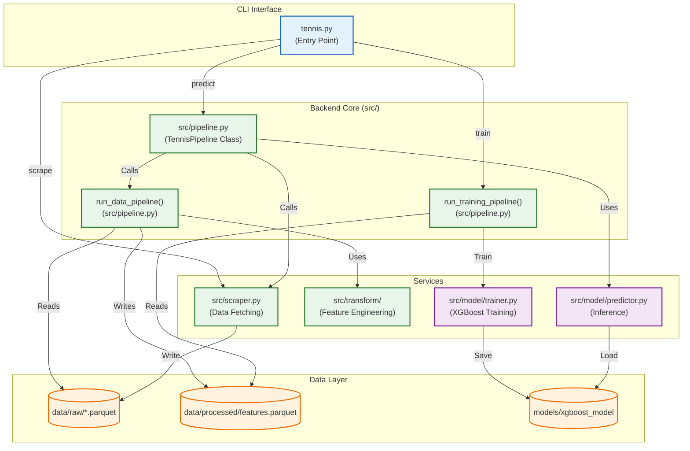

# System Architecture

## Component Map

## Module Responsibilities

### CLI
- **`tennis.py`**: Command-line interface. Wraps `src/pipeline.py` functions for scraping, training, and predicting.

### Backend Core (`src/pipeline.py`)
- **`TennisPipeline`**: High-level class. Consumes `Upcoming` data, calls `Predictor`, and applies value bet logic.
- **`run_data_pipeline`**: ETL function. `Raw -> Dedupe -> Features -> Processed`.
- **`run_training_pipeline`**: Model training function. `Processed -> Split -> Train -> Save`.

### Services
- **`src.scraper`**: Handles all scraping (Historical, Upcoming, Active Players). Includes "Smart Update" state management.
- **`src.transform`**: Feature engineering logic (`features.py`, `feature_engineer.py`).
- **`src.model`**: Wrapper around XGBoost/Sklearn for training (`trainer.py`) and inference (`predictor.py`).
