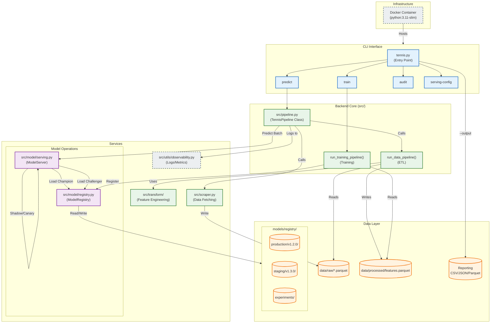

# System Architecture

## Component Map

## Module Responsibilities

### CLI & Infrastructure
- **`tennis.py`**: Command-line entry point using `argparse`. Dispatches subcommands (`train`, `predict`, `audit`, `promote`).
- **`Dockerfile`**: Defines the reproducible runtime environment.
- **`run_daily.bat`**: Windows automation script for scheduled execution.

### Backend Core (`src/pipeline.py`)
- **`TennisPipeline`**: High-level orchestration class.
  - Integrates **Observability** context managers for tracing.
  - Manages **Data Quality** gates (Schema validation, drift detection).
- **`run_data_pipeline`**: Orchestrates ETL (Raw -> Processed).

### Services

#### Model Operations (`src.model`)
- **`src.model.registry`**:
    - **Artifact Management**: Stores models in `models/registry/{stage}/{version}/`.
    - **Stages**: `experimental` -> `staging` -> `production` -> `archived`.
    - **Metadata**: Tracks metrics, timestamps, and promotion history in `model.meta.json`.
- **`src.model.serving`**:
    - **Advanced Serving**: Implements Canary deployments (percentage traffic), Shadow Mode (silent parallel execution), and Fallback (reliability).
    - **Loading**: Uniform loading interface for `xgboost` (native) and `joblib` (sklearn/pipeline) artifacts.
    - **Observability**: detailed logs for model selection and latency.

#### Data & Utilities
- **`src.scraper`**: Data collection with rate limiting, circuit breakers, and raw parquet storage.
- **`src.transform`**: Feature engineering logic and Pandera schema validation.
- **`src.utils.observability`**: Centralized structured logging (`structlog`) and Prometheus metrics integration.

### CI/CD
- **`.github/workflows/ci.yaml`**: Automated testing workflow.
    - Runs Unit Tests (`pytest tests/unit`).
    - Runs Integration Tests (`pytest tests/integration`).
    - Validates Code Quality (Linting).

## Serving Logic Flow

The **ModelServer** implements a sophisticated routing engine for inference:

1.  **Initialization**: Loads `active_model` (Production) and optional `challenger_model` (Staging).
2.  **Request Handling**:
    *   **Shadow Mode**: If enabled, predicts with Champion (returned to user) AND Challenger (logged for comparison).
    *   **Canary Mode**: If within canary percentage, predicts with Challenger.
    *   **Fallback**: If Champion fails prediction, automatically falls back to Challenger to prevent outage.
3.  **Response**: Returns structured JSON with prediction, probabilities, model version used, and serving mode (`champion_only`, `canary`, `shadow`, `fallback`).
