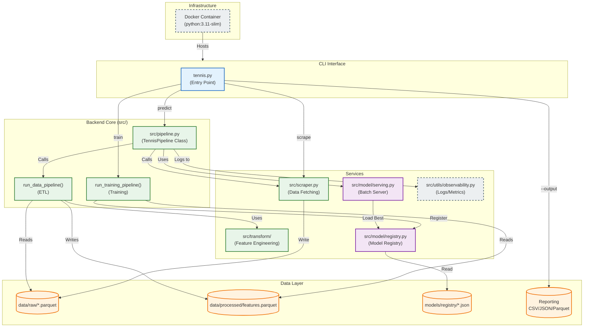

# System Architecture

## Component Map

## Module Responsibilities

### CLI & Infrastructure
- **`tennis.py`**: Command-line entry point. Handles argument parsing and dispatching.
- **`Dockerfile`**: Defines the reproducible runtime environment.
- **`run_daily.bat`**: Windows automation script for scheduled execution.

### Backend Core (`src/pipeline.py`)
- **`TennisPipeline`**: High-level orchestration class.
  - Integrates **Observability** context managers for tracing.
  - Manages **Data Quality** gates (Schema validation, drift detection).
- **`run_data_pipeline`**: Orchestrates ETL (Raw -> Processed).
- **`run_training_pipeline`**: Orchestrates Training (Processed -> Model Registry).

### Services
- **`src.scraper`**: Data collection with rate limiting and circuit breakers.
- **`src.transform`**: Feature engineering logic.
- **`src.model.registry`**: Manages model versions and promotion stages (Experimental -> Production).
- **`src.model.serving`**: Handles batch prediction requests using the best available model.
- **`src.utils.observability`**: Centralized structured logging (`structlog`) and Prometheus metrics.

### CI/CD
- **`.github/workflows/ci.yaml`**: Automated testing workflow triggered on push.
